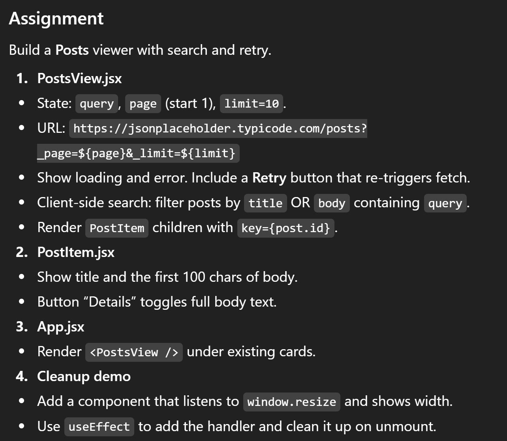

# Day 4 – Effects and Data Flow

## 0. Setup
```bash
cd react-master/projects/phase1
npm create vite@latest d4_effects-app -- --template react
cd d4_effects-app
npm install
npm run dev
```

## 1. Core Concepts
- useEffect(fn, deps) runs after render for side effects: fetch, I/O, timers, subscriptions.
- Cleanups prevent leaks: return a function from the effect.
- Data flow: parent holds data; children receive it via props.
- Fetch pattern: set [loading=true] &rarr; call [fetch] &rarr; set data or error &rarr; clear [loading=false].

## 2. Example
- Custom hook useFetch(url) with AbortController to cancel in-flight fetch on dependency change or unmount.
- TodoList renders server data. Clock uses setInterval with cleanup.

**Key snippets**
    // useFetch: set loading, fetch, handle error, cleanup with abort
    // TodoList: map with stable keys
    // Clock: setInterval in effect, clearInterval in cleanup
    
**src/hooks/useFetch.js**
```jsx
import { useEffect, useState } from "react";

export default function useFetch(url, options = {}) {
  const [data, setData] = useState(null);
  const [loading, setLoading] = useState(true);
  const [error, setError] = useState("");

  useEffect(() => {
    const ac = new AbortController();
    setLoading(true);
    setError("");
    setData(null);

    fetch(url, { signal: ac.signal, ...options })
      .then((r) => {
        if (!r.ok) throw new Error(`HTTP ${r.status}`);
        return r.json();
      })
      .then(setData)
      .catch((e) => {
        if (e.name !== "AbortError") setError(e.message || "fetch failed");
      })
      .finally(() => setLoading(false));

    return () => ac.abort();
  }, [url]);

  return { data, loading, error };
}

```
**src/components/TodoItem.jsx**
```jsx
export default function TodoItem({ title, completed }) {
  return (
    <li className="item">
      <span>{completed ? "✅" : "⬜"}</span>
      <span>{title}</span>
    </li>
  );
}

```

**src/components/TodoList.jsx**
```jsx
import TodoItem from "./TodoItem";

export default function TodoList({ todos }) {
  if (!todos?.length) return <p>No items.</p>;
  return (
    <ul className="list">
      {todos.map((t) => (
        <TodoItem key={t.id} title={t.title} completed={t.completed} />
      ))}
    </ul>
  );
}

```

**src/components/Clock.jsx (demonstrates cleanup)**
```jsx
import { useEffect, useState } from "react";

export default function Clock() {
  const [now, setNow] = useState(new Date());
  useEffect(() => {
    const id = setInterval(() => setNow(new Date()), 1000);
    return () => clearInterval(id); // cleanup
  }, []);
  return (
    <div className="card">
      <h3>Clock</h3>
      <p>{now.toLocaleTimeString()}</p>
    </div>
  );
}

```
**src/App.jsx**
```jsx
import { useState } from "react";
import useFetch from "./hooks/useFetch";
import TodoList from "./components/TodoList";
import Clock from "./components/Clock";

export default function App() {
  const [limit, setLimit] = useState(5);
  const { data, loading, error } = useFetch(
    `https://jsonplaceholder.typicode.com/todos?_limit=${limit}`
  );

  return (
    <div className="container">
      <h1>Day 4 – Effects and Data Flow</h1>

      <div className="controls">
        <label>
          Limit:
          <select value={limit} onChange={(e) => setLimit(Number(e.target.value))}>
            {[5, 10, 15].map((n) => (
              <option key={n} value={n}>{n}</option>
            ))}
          </select>
        </label>
      </div>

      <div className="card">
        <h3>Todos (remote)</h3>
        {loading && <p>Loading…</p>}
        {error && <p style={{ color: "tomato" }}>Error: {error}</p>}
        {!loading && !error && <TodoList todos={data} />}
      </div>

      <Clock />
    </div>
  );
}

```
**src/index.css**
```css
:root { color-scheme: dark; }
body { margin: 0; padding: 2rem; font-family: system-ui, sans-serif; }
.container { max-width: 900px; }
.card { border: 1px solid #555; border-radius: 8px; padding: 1rem; margin-block: 1rem; }
.controls { margin-bottom: 1rem; display: flex; gap: 1rem; }
.list { list-style: none; padding: 0; margin: 0; display: grid; gap: .5rem; }
.item { display: flex; gap: .5rem; align-items: center; padding: .5rem; border: 1px solid #444; border-radius: 6px; }

```



## 4. Reflection
- Effects should be minimal and focused; avoid putting logic that can run in render.
- Always include all reactive dependencies in the effect’s dependency array.
- Clean up timers, subscriptions, and event listeners to avoid leaks.
- Keep data in the highest component that needs it; pass down via props.
